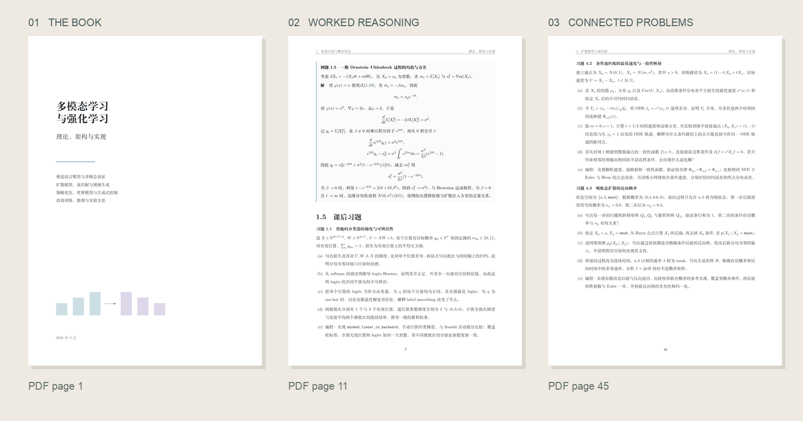
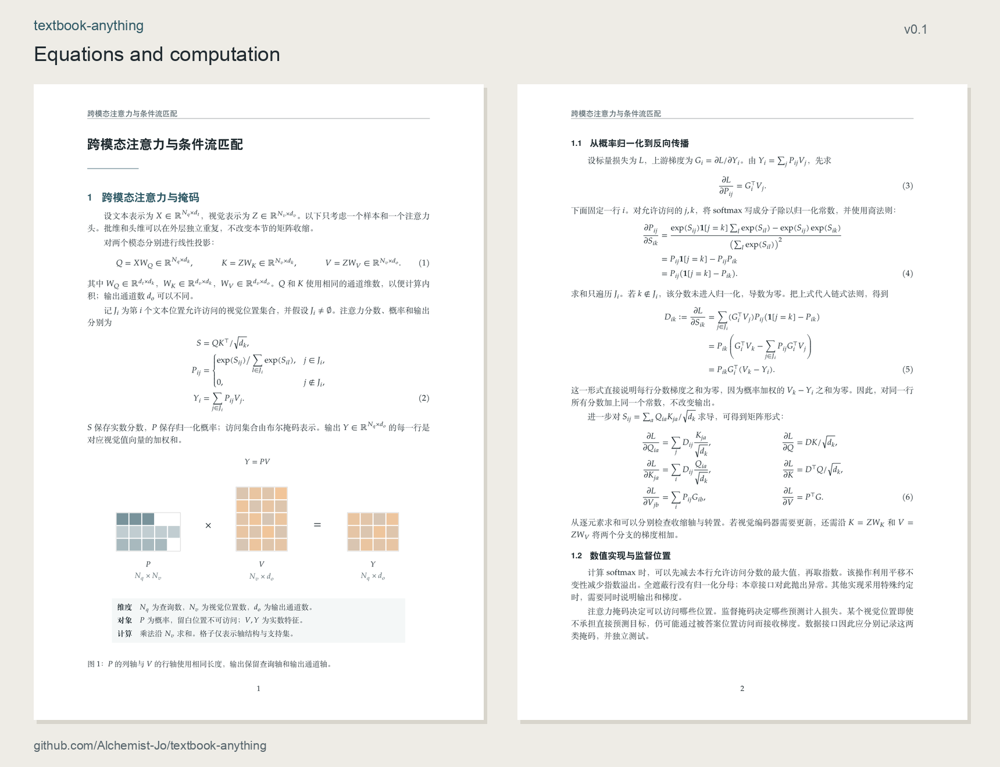
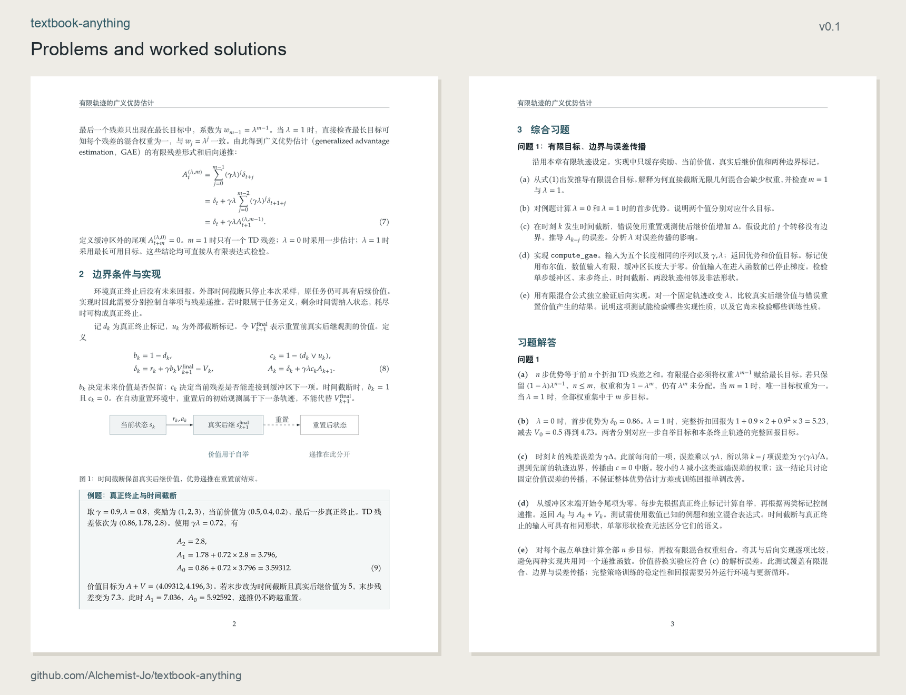

# textbook-anything

**English** | [简体中文](README.zh-CN.md)

[](https://github.com/Alchemist-Jo/textbook-anything/releases/tag/v0.1.0) [](LICENSE)

**University STEM textbooks, from the reader's prerequisites to the last worked solution.**

Turn a topic, a syllabus, or a collection of papers into teaching material with a coherent sequence, explicit reasoning, and problems worth working through. Use it for a whole book, a chapter, or a revision of existing course notes.

[Read the example textbook](examples/multimodal-learning/textbook.pdf) · [Install](#install) · [Open the skill](SKILL.md)



*多模态学习与强化学习：理论、架构与实现. 166 pages, in Chinese. [Example notes](examples/multimodal-learning/README.md).*

## How it works

A chapter begins with what its reader already knows and ends with something they can explain, derive, or implement. The work between those points is shared with existing skills:

| Stage | Method | What it produces |
| --- | --- | --- |
| Reader and goal | A brief `grilling` exchange | A concrete prerequisite baseline and learning goal |
| Scope and sequence | `deep-research` | Verified sources and a map of which ideas depend on which |
| Exposition and worked examples | `sepia`, professional prose | Clear explanations that preserve assumptions and technical detail |
| Exercises and solutions | Griffiths's teaching structure and the supplied problem sets | Local concept checks, connected chapter problems, and complete solutions |
| Delivery | A suitable document or figure skill, with local helpers when useful | Editable material and the requested PDF, code, or figures |

The exercise design combines immediate practice with longer synthesis problems. Within a substantial problem, the reader may derive a result, change an assumption, examine a limiting case, and check the conclusion numerically. The [design reference](references/exercise-models.md) explains what is drawn from Griffiths's *Introduction to Electrodynamics* and what is drawn from the supplied textbook.

The scope is university mathematics, physics, computing, and engineering. The subject determines the notation, examples, and experiments. Multimodal learning is one included example.

## Install

With the [Skills CLI](https://github.com/vercel-labs/skills):

```sh
npx skills add Alchemist-Jo/textbook-anything --skill textbook-anything -g
```

Choose your agent when prompted. To inspect the package first, add `--list` instead of `-g`. The repository contains one canonical `SKILL.md`; you can also place the complete directory in your agent's supported skill folder.

Companion skills are installed separately. Reuse the `grilling`, `deep-research`, and `sepia` entries already available in your environment. [Sepia](https://github.com/Nanako0129/sepia) and [Supervisor-Skills](https://github.com/HKUSTDial/Supervisor-Skills) provide installation instructions. Each companion runs through its complete skill instructions. For research documents built from mixed sources, [deepresearch-skill](https://github.com/WncFht/agent-basic-skill/tree/main/skills/deepresearch-skill) provides a document workflow. The [composition reference](references/skill-composition.md) defines these roles.

## Use

Ask for `textbook-anything` and supply the material you have. In an agent that uses dollar-prefixed skill names:

```text
Use $textbook-anything to write a chapter on Fourier analysis for
second-year engineering students. They know calculus and linear algebra.
Research the prerequisites, explain the derivations, and include worked
examples plus a connected problem set with solutions. Deliver LaTeX and PDF.
```

| Request | Scope |
| --- | --- |
| Write | Develop a book or chapter from the topic and source material. |
| Expand | Add missing reasoning, examples, or exercises while preserving the existing scope. |
| Revise | Improve structure and content, carrying changes into dependent material. |
| Review | Return located findings without editing the source. |

These are ordinary requests to one skill. There are no extra commands to remember.

For a revision, say what must stay and what needs attention:

```text
Use textbook-anything to revise these course notes. Keep the original
topics, repair missing derivation steps, and redesign the exercises around
shared problems with complete solutions. Preserve the current document format.
```

## Examples and tools

Alongside the [full textbook](examples/multimodal-learning/textbook.pdf), two short LaTeX examples cover [finite-trajectory GAE](examples/gae/main.tex) and [attention with Gaussian flow](examples/attention-flow/main.tex). They share numerical code and tests. The included [typesetting style](references/typography.md) pairs serif body text with sans-serif headings and a matching mathematics font, with spacing designed for derivations.

[Read the GAE example](examples/gae/handout.pdf) · [Read the attention and flow example](examples/attention-flow/handout.pdf)

<details>
<summary>See two typeset examples</summary>





</details>

```sh
python3 scripts/check_skill.py
python3 -m unittest discover -s examples/tests -v
```

These commands use the Python standard library. PDF compilation needs XeLaTeX; page rendering needs PyMuPDF. See [local helpers](scripts/README.md) for build commands and dependencies.

## Layout

```text
textbook-anything/
├── SKILL.md                 # teaching workflow and routing
├── references/              # research, writing, exercises, and delivery
├── templates/               # project brief and STEM typography
├── examples/                # textbook PDF, short sources, code, and tests
├── scripts/                 # package check, PDF build, page rendering
└── agents/openai.yaml       # display metadata
```

## v0.1

This is the first public release. Work will continue in three areas:

- **Content:** stronger explanations, broader STEM examples, and better links between chapters.
- **Delivery:** document templates, figure layout, and easier source-to-PDF builds.
- **Assessment:** problem progression, hints, solutions, and marking criteria that test understanding.

For a correction, include the section or problem, what is wrong, and a source or worked argument that helps resolve it. [Open an issue](https://github.com/Alchemist-Jo/textbook-anything/issues).

## Acknowledgments and license

[Sepia](https://github.com/Nanako0129/sepia) informed the language pass and repository layout. Prerequisite research reuses the `deep-research` skill from [Supervisor-Skills](https://github.com/HKUSTDial/Supervisor-Skills) when available. Exercise organization draws on [Griffiths's preface](https://assets.cambridge.org/97811084/20419/frontmatter/9781108420419_frontmatter.pdf) and the author's supplied textbook. The document workflow also draws on [deepresearch-skill](https://github.com/WncFht/agent-basic-skill/tree/main/skills/deepresearch-skill). Companion skills and external sources retain their own licenses and are not bundled here.

[MIT](LICENSE).
