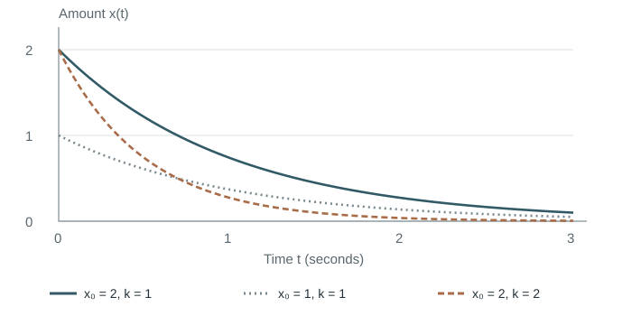

# Entering a field: a first-order system

This example applies [learning from scratch](../../references/learning-from-scratch.md) to a reader entering dynamical systems. It shows how a small model budget can still produce a complete learning unit, and how later tiers can extend it without starting over.

## Starting point and gaps

Assume the reader knows exponentials and has encountered derivatives, but is new to differential-equation models. These are assumptions for the example, not results from a learner assessment.

| What the reader needs | Why it matters | Teaching action |
| --- | --- | --- |
| State, parameter, and initial condition | Their different roles determine how a trajectory changes. | Name each one in a concrete model. |
| Rate of change | A differential equation describes a local rule. | Connect the derivative to a change per unit time. |
| Proportional versus constant loss | Similar-looking descriptions produce different trajectories. | Compare the rates at two values of the state. |
| A check of the solution | Recognizing an exponential does not establish that it solves the model. | Differentiate the expression and check its initial value. |

An optional entry check is to differentiate `2 exp(−t)`. Its derivative is `−2 exp(−t)`. If that step is unfamiliar, first explain the derivative as the limiting change per unit time and work through the exponential derivative used here. Keep the learner's status unassessed until an actual attempt is available.

## A complete lite unit

**Outcome:** explain a proportional decay model, check its solution, and predict the effect of changing its initial value or rate.

Let `x(t)` be an amount at time `t`, measured in seconds. A proportional decay model is

$$
\frac{dx}{dt}=-kx,\qquad x(0)=x_0>0,\qquad k\geq0.
$$

The state `x` changes with time. The parameter `k` is held fixed and has units of inverse seconds. The initial condition `x₀` fixes where the trajectory begins. If `k = 1`, the instantaneous rate is `−2` when `x = 2` and `−1` when `x = 1`. A constant loss of two units per second would keep the rate at `−2` instead.

The proposed solution is `x(t) = x₀ exp(−kt)`. Differentiating it gives `−k x₀ exp(−kt)`, which equals `−kx(t)`. At time zero the exponential is one, so the initial condition also holds. These two checks connect the expression to the local rule and its starting value.

For `x₀ = 2` and `k = 1`, the amount is one at `t = log 2`. The initial amount sets the vertical scale, while the rate changes how quickly the trajectory decreases. The [HTML lesson](../../templates/tutorial.html) contains a local-rate diagram and computed curves for different rates.

The curves are calculated from the model. Halving the initial amount rescales the trajectory; doubling the positive rate makes it reach the same fraction of its starting value sooner. Rates in the legend are measured in inverse seconds.

**Guided completion:** keep `x₀ = 2` and change `k` to two. Write the new trajectory, then solve for the time at which it reaches one. Explain where the factor of two enters the calculation.

**Independent variation:** start at four with `k = 2`. Find the amount at `t = (log 2)/2`. Does doubling the initial amount change the time needed to reach half of that amount? Also explain the case `k = 0`.

Solutions and feedback

The guided trajectory is `2 exp(−2t)`. Setting it equal to one gives `t = (log 2)/2`. For the independent case, `4 exp(−2t)` equals two at that same time. The half-life depends on the positive rate, not on the positive initial amount. When `k = 0`, the state remains constant and has no finite half-life.

If the initial amount appears in the half-life formula, revisit the step where the target is written as `x₀/2`; `x₀` cancels. If the result predicts a finite half-life at zero rate, inspect the condition under which division by `k` was used.

The unit establishes how to interpret and check one scalar decay model. It does not yet teach general solution methods for differential equations, forced systems, or numerical stability.

## Extend at another tier

| Tier | Agreed outcome | What is added | What still needs its own lesson |
| --- | --- | --- | --- |
| Lite | Interpret and check the scalar model above | One complete explanation, worked case, guided completion, independent variation, and answer | General ODE methods and numerical stability |
| Standard | Connect the continuous model to a simple numerical implementation | Derive the Euler update, compare it to the exact solution, and distinguish nonnegative decay from numerical convergence | Driven systems and a broader account of stability |
| Deep | Use this model to enter first-order system analysis | Compare exact and approximate trajectories, introduce a constant input, analyze the equilibrium and its conditions, and interpret failure cases | Nonlinear and multivariable systems outside the agreed scope |

The standard extension can use the exercises already included in the HTML lesson. The deep extension should develop its new assumptions and solutions before claiming those topics are covered. Preserve the lite unit's accepted notation and learner attempts when extending it.

A useful later retrieval task is to explain, without looking back, the roles of state, parameter, and initial condition, and then predict what changes if only one of them is altered. A correct worked solution in this file is not evidence that the reader has completed that task.
